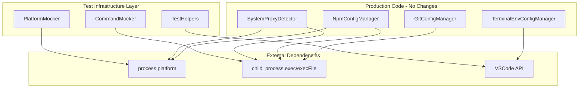

# Design Document

## Overview

**Purpose**: この機能は、otak-proxy拡張機能のクロスプラットフォーム対応を強化し、Windows、macOS、Linuxの各プラットフォームでのプロキシ管理機能を確実に動作させるためのテストカバレッジを提供する。

**Users**: VSCode拡張機能の開発者およびCI/CDパイプラインが、各プラットフォームでの動作を検証するために利用する。

**Impact**: 既存の実装コードは変更せず、テストインフラストラクチャの拡充によりプラットフォーム固有の動作を検証可能にする。

### Goals
- 各プラットフォーム（Windows、macOS、Linux）のプロキシ検出ロジックをモックテストでカバー
- プラットフォーム固有のエラーケース（タイムアウト、ENOENT、権限エラー）を網羅
- 検出優先順位のフォールバック動作を検証
- 既存のWindows実装に影響を与えない

### Non-Goals
- 実装コードの変更（既存コードは既にクロスプラットフォーム対応済み）
- Linux非GNOMEデスクトップ環境のサポート（将来の拡張として検討）
- 実機での統合テスト自動化（現時点ではローカル検証に依存）

## Architecture

### Existing Architecture Analysis

現在のアーキテクチャは以下の特徴を持つ：

- **SystemProxyDetector**: `process.platform`による分岐と、`child_process.exec`によるOS固有コマンド実行
- **NpmConfigManager**: `isWindows`フラグによるシェル実行オプション制御
- **GitConfigManager**: `execFile`による直接コマンド実行（シェル不使用）
- **TerminalEnvConfigManager**: VSCode API抽象化によるプラットフォーム非依存

既存の課題：
- テストがシステム依存（実際のgit/npm/OSコマンドに依存）
- `process.platform`のモックが困難な構造
- エラーケースの網羅的テストが未実施

### Architecture Pattern & Boundary Map



**Architecture Integration**:
- Selected pattern: 依存性注入を使用しないスタブアプローチ（既存コード変更なし）
- Domain/feature boundaries: テストコードのみ新規追加
- Existing patterns preserved: Sinon + Mocha + fast-checkの既存テストパターン
- New components rationale: モッキングユーティリティの追加による再利用性向上
- Steering compliance: 日本語コミュニケーション維持

### Technology Stack

| Layer | Choice / Version | Role in Feature | Notes |
|-------|------------------|-----------------|-------|
| Test Framework | Mocha (via @vscode/test-cli) | テスト実行基盤 | 既存利用 |
| Mocking | Sinon v19.0.2 | スタブ/スパイ/モック | 既存利用 |
| Property Testing | fast-check v4.3.0 | ランダム入力テスト | 既存利用 |
| Runtime | Node.js 20.x | TypeScript実行環境 | 既存利用 |

## Requirements Traceability

| Requirement | Summary | Components | Interfaces | Flows |
|-------------|---------|------------|------------|-------|
| 1.1, 1.2, 1.3, 1.4 | OS環境検出 | SystemProxyDetector | detectSystemProxy, detectSystemProxyWithSource | Platform Detection Flow |
| 2.1-2.6 | Windows機能互換性 | All ConfigManagers | setProxy, unsetProxy, getProxy | Config Management Flow |
| 3.1-3.7 | macOS対応 | SystemProxyDetector, ConfigManagers | detectMacOSProxy | Platform Detection Flow |
| 4.1-4.7 | Linux対応 | SystemProxyDetector, ConfigManagers | detectLinuxProxy | Platform Detection Flow |
| 5.1-5.5 | 検出優先順位 | SystemProxyDetector | updateDetectionPriority | Priority Fallback Flow |
| 6.1-6.6 | エラーハンドリング | All Components | OperationResult | Error Handling Flow |
| 7.1-7.4 | 検出結果検証 | ProxyUrlValidator | validate | Validation Flow |
| 8.1-8.4 | パス/コマンド互換性 | NpmConfigManager, GitConfigManager | execNpm, execFileAsync | Command Execution Flow |
| 9.1-9.4 | テストカバレッジ | TestHelpers, Mockers | mockPlatform, mockExec | Test Infrastructure |

## Components and Interfaces

| Component | Domain/Layer | Intent | Req Coverage | Key Dependencies (P0/P1) | Contracts |
|-----------|--------------|--------|--------------|--------------------------|-----------|
| PlatformMocker | Test Infrastructure | process.platformのモック化 | 9.4 | Sinon (P0) | Service |
| CommandMocker | Test Infrastructure | child_process実行のモック化 | 9.1, 9.2 | Sinon (P0) | Service |
| CrossPlatformTestSuite | Test Infrastructure | 各プラットフォームテストケース | 9.1-9.4 | Mocha (P0), PlatformMocker (P1) | Service |
| EdgeCaseTestSuite | Test Infrastructure | エラーケーステスト | 6.1-6.6, 9.2 | CommandMocker (P0) | Service |

### Test Infrastructure Layer

#### PlatformMocker

| Field | Detail |
|-------|--------|
| Intent | process.platformプロパティを安全にモック/リストア |
| Requirements | 9.4 |

**Responsibilities & Constraints**
- Sinon sandboxによるprocess.platformのスタブ化
- テスト終了時の確実なリストア
- 複数テスト間での状態分離保証

**Dependencies**
- External: Sinon v19.0.2 - スタブ機能 (P0)

**Contracts**: Service [x]

##### Service Interface
```typescript
interface PlatformMocker {
  /**
   * process.platformを指定値にモックする
   * @param platform - 'win32' | 'darwin' | 'linux'
   * @returns sandbox - リストア用のSinon sandbox
   */
  mockPlatform(platform: NodeJS.Platform): sinon.SinonSandbox;

  /**
   * モックをリストアして元の状態に戻す
   * @param sandbox - mockPlatformで返されたsandbox
   */
  restore(sandbox: sinon.SinonSandbox): void;
}
```
- Preconditions: validなplatform値が渡される
- Postconditions: process.platformが指定値を返す状態になる
- Invariants: restore後は元のplatform値に復帰

**Implementation Notes**
- Integration: Sinon sandboxパターンを使用し、テスト間の分離を保証
- Validation: platform値の型チェックはTypeScriptで担保
- Risks: グローバル状態の変更のため、restore忘れに注意

#### CommandMocker

| Field | Detail |
|-------|--------|
| Intent | child_process.exec/execFileのモック化とレスポンス制御 |
| Requirements | 9.1, 9.2 |

**Responsibilities & Constraints**
- exec/execFileのスタブ化
- 成功/失敗レスポンスの注入
- タイムアウト/ENOENTエラーのシミュレーション

**Dependencies**
- External: Sinon v19.0.2 - スタブ機能 (P0)
- External: child_process - モック対象 (P0)

**Contracts**: Service [x]

##### Service Interface
```typescript
interface CommandMocker {
  /**
   * exec/execFileをモックし、指定のレスポンスを返すよう設定
   */
  mockExec(
    command: string | RegExp,
    response: ExecMockResponse
  ): sinon.SinonSandbox;

  /**
   * 複数コマンドのモックを一括設定
   */
  mockMultipleCommands(
    mocks: Array<{ command: string | RegExp; response: ExecMockResponse }>
  ): sinon.SinonSandbox;

  /**
   * モックをリストア
   */
  restore(sandbox: sinon.SinonSandbox): void;
}

interface ExecMockResponse {
  stdout?: string;
  stderr?: string;
  error?: {
    code?: string | number;
    message?: string;
    killed?: boolean;
    signal?: string;
  };
}
```
- Preconditions: commandパターンが有効な正規表現またはstring
- Postconditions: 対象コマンド実行時に指定レスポンスを返却
- Invariants: 未設定コマンドは元の動作を維持

**Implementation Notes**
- Integration: `stub.yields()`を使用してコールバックに結果を注入
- Validation: ExecMockResponseの型安全性をTypeScriptで保証
- Risks: 非同期コールバックのタイミング制御に注意

#### CrossPlatformTestSuite

| Field | Detail |
|-------|--------|
| Intent | Windows/macOS/Linux各プラットフォームの動作テスト |
| Requirements | 1.1-1.4, 3.1-3.4, 4.1-4.4, 9.1 |

**Responsibilities & Constraints**
- 各プラットフォームのプロキシ検出ロジックをテスト
- OSコマンド出力のパースロジックを検証
- プラットフォーム間での一貫した動作を確認

**Dependencies**
- Inbound: PlatformMocker - プラットフォーム切替 (P0)
- Inbound: CommandMocker - コマンド出力モック (P0)
- External: Mocha - テスト実行 (P0)

**Contracts**: Service [x]

##### Test Cases Structure
```typescript
interface CrossPlatformTestCases {
  windows: {
    registryEnabled: TestCase;      // ProxyEnable=1のケース
    registryDisabled: TestCase;     // ProxyEnable=0のケース
    httpEqualsFormat: TestCase;     // "http=proxy:port;https=proxy:port"形式
    simpleFormat: TestCase;         // "proxy:port"形式
  };
  macos: {
    wifiEnabled: TestCase;          // Wi-Fiプロキシ有効
    ethernetEnabled: TestCase;      // Ethernetプロキシ有効
    noInterface: TestCase;          // インターフェース未存在
    proxyDisabled: TestCase;        // プロキシ無効
  };
  linux: {
    manualMode: TestCase;           // mode='manual'
    autoMode: TestCase;             // mode='auto'（非対応）
    noGsettings: TestCase;          // gsettings未インストール
  };
}
```

**Implementation Notes**
- Integration: describe/itブロックでプラットフォーム別に構造化
- Validation: assert.strictEqualで期待値を厳密比較
- Risks: モックの設定漏れによる実コマンド実行

#### EdgeCaseTestSuite

| Field | Detail |
|-------|--------|
| Intent | エラーケースとエッジケースの網羅的テスト |
| Requirements | 6.1-6.6, 9.2 |

**Responsibilities & Constraints**
- ENOENT（コマンド未存在）エラーの検証
- タイムアウトエラーの検証
- 権限エラー（EACCES）の検証
- 不正な出力形式の処理検証

**Dependencies**
- Inbound: CommandMocker - エラー注入 (P0)
- External: Mocha - テスト実行 (P0)

**Contracts**: Service [x]

##### Error Test Cases
```typescript
interface EdgeCaseTestCases {
  commandNotFound: {
    gitNotInstalled: TestCase;      // error.code = 'ENOENT'
    npmNotInstalled: TestCase;
    regQueryNotFound: TestCase;
    networksetupNotFound: TestCase;
    gsettingsNotFound: TestCase;
  };
  timeout: {
    gitTimeout: TestCase;           // error.killed = true
    npmTimeout: TestCase;
    registryTimeout: TestCase;
  };
  permission: {
    gitPermissionDenied: TestCase;  // error.code = 'EACCES'
    npmPermissionDenied: TestCase;
  };
  invalidOutput: {
    malformedRegistryOutput: TestCase;
    invalidNetworksetupOutput: TestCase;
    invalidGsettingsOutput: TestCase;
  };
}
```

**Implementation Notes**
- Integration: error objectの各フィールドを個別にモック
- Validation: OperationResult.errorTypeの値を検証
- Risks: エラーパターンの網羅性確保

## Data Models

### Domain Model

本機能はテストインフラストラクチャのため、新規ドメインモデルは追加しない。

既存の型を再利用：
- `DetectionSource`: プロキシ検出元の識別
- `ProxyDetectionWithSource`: 検出結果とソース情報
- `OperationResult`: 操作結果とエラー情報

### Test Data Patterns

```typescript
// Windowsレジストリ出力のモックデータ
const WINDOWS_REGISTRY_ENABLED = `
    ProxyEnable    REG_DWORD    0x1
`;

const WINDOWS_REGISTRY_SERVER = `
    ProxyServer    REG_SZ    http=proxy.example.com:8080;https=proxy.example.com:8080
`;

// macOS networksetup出力のモックデータ
const MACOS_PROXY_ENABLED = `
Enabled: Yes
Server: proxy.example.com
Port: 8080
Authenticated Proxy Enabled: 0
`;

// Linux gsettings出力のモックデータ
const LINUX_MODE_MANUAL = `'manual'`;
const LINUX_HOST = `'proxy.example.com'`;
const LINUX_PORT = `8080`;
```

## Error Handling

### Error Strategy

テストにおけるエラーハンドリングは以下の方針に従う：

1. **モック設定エラー**: テスト失敗として即時報告
2. **期待値不一致**: assertによる明確なエラーメッセージ
3. **リストア失敗**: afterEachフックでの確実なクリーンアップ

### Error Categories and Responses

**テスト対象エラー** (SystemProxyDetector, ConfigManagers):
- ENOENT → `{ errorType: 'NOT_INSTALLED' }`
- EACCES → `{ errorType: 'NO_PERMISSION' }`
- Timeout → `{ errorType: 'TIMEOUT' }`

**テスト検証項目**:
- エラー発生時にnullを返却すること
- 適切なerrorTypeが設定されること
- Loggerにエラーが記録されること

## Testing Strategy

### Unit Tests
- **PlatformMocker**: 3つのプラットフォーム値のモック/リストア
- **CommandMocker**: 成功/失敗/タイムアウトの各パターン
- **SystemProxyDetector**: 各プラットフォームの検出ロジック（モック使用）
- **ConfigManagers**: 各操作のエラーハンドリング（モック使用）

### Integration Tests
- 検出優先順位に従ったフォールバック動作
- 複数ソース間の切り替え
- エラー時の次ソースへの移行

### Property-Based Tests (fast-check)
- ランダムなプロキシURL形式での検証動作
- 各プラットフォームでの一貫した動作確認
- エッジケース自動発見

### Test Coverage Targets
- SystemProxyDetector: 各プラットフォームメソッド100%カバー
- ConfigManagers: エラーハンドリングパス100%カバー
- 全体: 行カバレッジ90%以上

## Optional Sections

### Security Considerations

テストコードのセキュリティ考慮事項：

- モックデータに実際のプロキシ認証情報を含めない
- テスト用プロキシURLは`example.com`ドメインを使用
- CI/CD環境でのテスト実行時は環境変数を隔離

### Future Considerations

**Linux非GNOME対応** (将来の検討事項):
- KDE環境: `kreadconfig5`コマンドによる検出
- Xfce環境: `xfconf-query`コマンドによる検出
- 環境変数フォールバック: `http_proxy`の優先度上昇

これらは現スコープ外とし、将来のイシューとして管理する。

## Supporting References

### Sinon Stubbing Patterns

```typescript
// exec/execFileのスタブパターン
const sandbox = sinon.createSandbox();
const execStub = sandbox.stub(child_process, 'exec');

// 成功レスポンス
execStub.yields(null, 'stdout content', '');

// エラーレスポンス
const error = new Error('Command not found');
(error as any).code = 'ENOENT';
execStub.yields(error, '', 'stderr content');

// クリーンアップ
sandbox.restore();
```

### Platform Mocking Pattern

```typescript
// process.platformのモック（Object.definePropertyを使用）
const originalPlatform = process.platform;
Object.defineProperty(process, 'platform', {
  value: 'darwin',
  writable: true,
  configurable: true
});

// テスト後のリストア
Object.defineProperty(process, 'platform', {
  value: originalPlatform,
  writable: false,
  configurable: true
});
```
