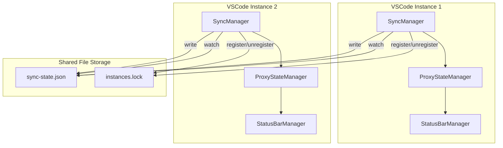
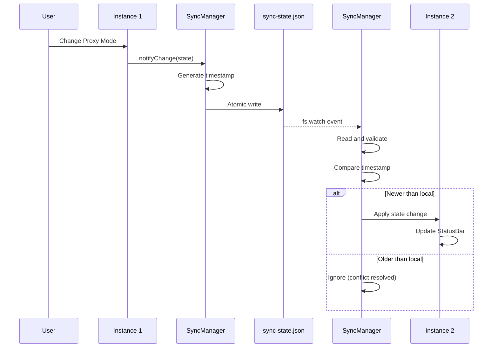
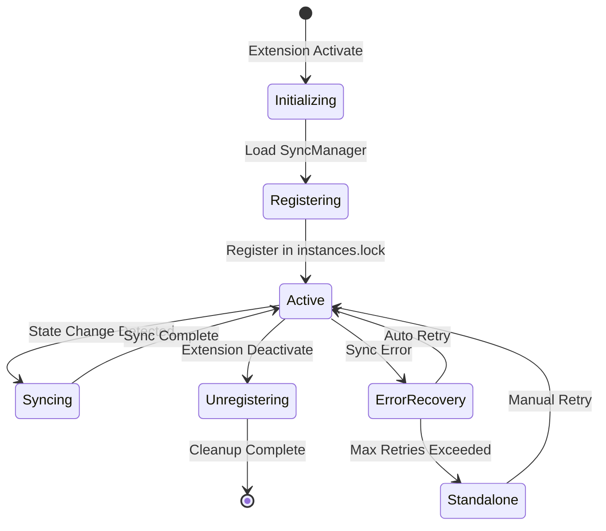

# Design Document: Multi-Instance Sync

## Overview

**Purpose**: この機能は、複数のVSCode/Cursorインスタンス間でotak-proxyのプロキシ設定をリアルタイムに同期し、開発者が複数ウィンドウを使用する際の一貫したプロキシ状態を実現する。

**Users**: 複数のVSCode/Cursorインスタンスを同時に開いて作業する開発者が、1つのインスタンスでプロキシ設定を変更した際に、他のすべてのインスタンスへ自動的に設定が伝播される。

**Impact**: 現在の独立したインスタンスごとの状態管理（globalState）に加え、ファイルベースの共有状態レイヤーを追加し、インスタンス間同期を実現する。

### Goals

- 同一マシン上の複数otak-proxyインスタンス間でプロキシ設定（モード、URL、有効状態）を1秒以内に同期
- タイムスタンプベースの競合解決により、最新の変更を優先的に採用
- 同期機能の障害が既存のプロキシ管理機能に影響を与えない堅牢な設計
- 追加の外部依存なしでNode.js標準APIのみで実装

### Non-Goals

- 異なるマシン間での同期（クラウド同期）は対象外
- VSCode Settings Syncとの統合は将来検討として除外
- リアルタイム双方向編集（同時編集の即座反映）は対象外
- 暗号化された通信チャネルは不要（ローカルファイルのみ）

## Architecture

### Existing Architecture Analysis

現在のotak-proxyは以下の構造を持つ:

- **ProxyStateManager**: `globalState`を使用したインスタンス固有の状態永続化
- **StatusBarManager**: プロキシ状態の視覚的表示
- **ExtensionInitializer**: 初期化と監視の統合
- **EventEmitter Pattern**: ProxyMonitorで採用済みのイベント駆動パターン

**制約**: VSCodeの`globalState`は複数ウィンドウ間で同期されない（GitHub Issue #55834で報告済み）。そのため、ファイルベースの共有状態レイヤーが必要。

### Architecture Pattern & Boundary Map



**Architecture Integration**:
- **Selected pattern**: ファイルベースPub/Subパターン - 共有ファイルを介した疎結合な状態同期
- **Domain boundaries**: SyncManagerが同期ロジックを担当し、ProxyStateManagerはローカル状態管理に専念
- **Existing patterns preserved**: 依存性注入、イベントEmitterパターン、インターフェース分離
- **New components rationale**: SyncManager（同期制御）、SharedStateFile（共有状態永続化）、InstanceRegistry（インスタンス管理）
- **Steering compliance**: TypeScript strict mode、外部依存なし、単一責務の原則

### Technology Stack

| Layer | Choice / Version | Role in Feature | Notes |
|-------|------------------|-----------------|-------|
| Runtime | Node.js (VSCode built-in) | ファイル操作、ファイル監視 | fs.watch API使用 |
| Data / Storage | JSON File | 共有状態ストレージ | globalStorageUri配下 |
| Messaging / Events | EventEmitter | インスタンス内イベント通知 | 既存パターンを継続 |

## System Flows

### Proxy Setting Change Propagation Flow



### Instance Lifecycle Flow



## Requirements Traceability

| Requirement | Summary | Components | Interfaces | Flows |
|-------------|---------|------------|------------|-------|
| 1.1, 1.2, 1.3, 1.4 | インスタンス検出 | InstanceRegistry | IInstanceRegistry | Instance Lifecycle |
| 2.1, 2.2, 2.3, 2.4, 2.5 | プロキシ設定同期 | SyncManager, SharedStateFile | ISyncManager, ISharedStateFile | Change Propagation |
| 3.1, 3.2, 3.3 | 接続テスト結果共有 | SyncManager | ISyncManager | Change Propagation |
| 4.1, 4.2, 4.3, 4.4 | 競合解決 | ConflictResolver | IConflictResolver | Change Propagation |
| 5.1, 5.2, 5.3, 5.4, 5.5 | 同期メカニズム | SharedStateFile, FileWatcher | ISharedStateFile, IFileWatcher | All |
| 6.1, 6.2, 6.3, 6.4 | ステータス表示 | SyncStatusProvider | ISyncStatusProvider | - |
| 7.1, 7.2, 7.3, 7.4, 7.5 | エラーハンドリング | SyncManager, ErrorRecovery | ISyncManager | ErrorRecovery State |
| 8.1, 8.2, 8.3, 8.4 | 設定とカスタマイズ | SyncConfigManager | ISyncConfigManager | - |

## Components and Interfaces

| Component | Domain/Layer | Intent | Req Coverage | Key Dependencies | Contracts |
|-----------|--------------|--------|--------------|------------------|-----------|
| SyncManager | Core/Sync | インスタンス間同期の中央制御 | 1.1-1.4, 2.1-2.5, 3.1-3.3, 7.1-7.5 | SharedStateFile (P0), InstanceRegistry (P0), ProxyStateManager (P0) | Service, Event, State |
| SharedStateFile | Data/Persistence | 共有状態の永続化とアトミック操作 | 5.1-5.5 | fs (P0) | Service, State |
| InstanceRegistry | Core/Sync | アクティブインスタンスの登録と管理 | 1.1-1.4 | fs (P0) | Service, State |
| ConflictResolver | Core/Sync | タイムスタンプベースの競合解決 | 4.1-4.4 | None | Service |
| FileWatcher | Monitoring/Sync | 共有ファイルの変更監視 | 5.3, 5.4 | fs.watch (P0) | Event |
| SyncStatusProvider | UI/Sync | 同期状態のStatusBar表示 | 6.1-6.4 | StatusBarManager (P1) | State |
| SyncConfigManager | Config/Sync | 同期設定の管理 | 8.1-8.4 | vscode.workspace (P1) | State |

### Core/Sync

#### SyncManager

| Field | Detail |
|-------|--------|
| Intent | 複数インスタンス間のプロキシ状態同期を制御する中央コンポーネント |
| Requirements | 1.1, 1.2, 1.3, 1.4, 2.1, 2.2, 2.3, 2.4, 2.5, 3.1, 3.2, 3.3, 7.1, 7.2, 7.3, 7.4, 7.5 |

**Responsibilities & Constraints**
- 同期ライフサイクル全体の管理（開始、停止、エラー回復）
- ローカル状態変更の検出と共有ファイルへの伝播
- リモート変更の受信とローカル状態への反映
- 同期機能が無効化されている場合はスタンドアロンモードで動作

**Dependencies**
- Inbound: ExtensionInitializer - 初期化と終了処理 (P0)
- Outbound: SharedStateFile - 共有状態の読み書き (P0)
- Outbound: InstanceRegistry - インスタンス登録管理 (P0)
- Outbound: ProxyStateManager - ローカル状態の取得と更新 (P0)
- Outbound: FileWatcher - ファイル変更監視 (P0)
- Outbound: ConflictResolver - 競合解決 (P1)
- Outbound: SyncStatusProvider - 状態表示更新 (P1)

**Contracts**: Service [x] / API [ ] / Event [x] / Batch [ ] / State [x]

##### Service Interface

```typescript
interface ISyncManager {
  /**
   * 同期サービスを開始する
   * @returns 開始成功時true
   */
  start(): Promise<boolean>;

  /**
   * 同期サービスを停止する
   */
  stop(): Promise<void>;

  /**
   * ローカル状態変更を他のインスタンスに通知する
   * @param state 変更後のProxyState
   */
  notifyChange(state: ProxyState): Promise<void>;

  /**
   * 手動で同期をトリガーする
   */
  triggerSync(): Promise<SyncResult>;

  /**
   * 現在の同期状態を取得する
   */
  getSyncStatus(): SyncStatus;

  /**
   * 同期が有効かどうかを確認する
   */
  isEnabled(): boolean;
}

interface SyncResult {
  success: boolean;
  instancesNotified: number;
  conflictsResolved: number;
  error?: string;
}

interface SyncStatus {
  enabled: boolean;
  activeInstances: number;
  lastSyncTime: number | null;
  lastError: string | null;
  isSyncing: boolean;
}
```

- **Preconditions**: ExtensionContextが有効であること
- **Postconditions**: start()後はファイル監視がアクティブ、stop()後はリソース解放完了
- **Invariants**: 同期中でも既存のプロキシ機能は動作継続

##### Event Contract

- **Published events**:
  - `syncStateChanged`: 同期状態が変化した時（SyncStatus）
  - `remoteChange`: リモートからの変更を受信した時（ProxyState）
  - `conflictResolved`: 競合が解決された時（ConflictInfo）
  - `syncError`: 同期エラー発生時（Error）
- **Subscribed events**:
  - ProxyStateManager: 状態変更イベント
  - FileWatcher: ファイル変更イベント
- **Ordering / delivery guarantees**: 同一インスタンス内では順序保証、インスタンス間はタイムスタンプで整合

##### State Management

- **State model**: SyncManagerState { enabled, activeInstances, lastSyncTime, errors[] }
- **Persistence**: メモリ内（永続化不要、起動時に再構築）
- **Concurrency strategy**: シングルスレッド、非同期キュー処理

**Implementation Notes**
- Integration: ExtensionInitializerのPhase 4.5として初期化（ProxyMonitor後、StatusBar前）
- Validation: ファイルアクセス失敗時はスタンドアロンモードにフォールバック
- Risks: ファイルシステム監視の信頼性（fs.watchはプラットフォーム依存）

---

#### InstanceRegistry

| Field | Detail |
|-------|--------|
| Intent | アクティブなotak-proxyインスタンスの登録と検出を管理する |
| Requirements | 1.1, 1.2, 1.3, 1.4 |

**Responsibilities & Constraints**
- インスタンス起動時の登録（プロセスID、ウィンドウID、タイムスタンプ）
- インスタンス終了時の登録解除
- 古いエントリのクリーンアップ（ゾンビ検出）
- ヘルスチェックによるアクティブ確認

**Dependencies**
- Inbound: SyncManager - 登録/解除の呼び出し (P0)
- External: fs - ファイルI/O (P0)

**Contracts**: Service [x] / API [ ] / Event [ ] / Batch [ ] / State [x]

##### Service Interface

```typescript
interface IInstanceRegistry {
  /**
   * 現在のインスタンスを登録する
   * @returns 登録成功時true
   */
  register(): Promise<boolean>;

  /**
   * 現在のインスタンスの登録を解除する
   */
  unregister(): Promise<void>;

  /**
   * アクティブなインスタンス一覧を取得する
   * @returns インスタンス情報の配列
   */
  getActiveInstances(): Promise<InstanceInfo[]>;

  /**
   * 他にアクティブなインスタンスが存在するか確認する
   */
  hasOtherInstances(): Promise<boolean>;

  /**
   * 非アクティブなインスタンスをクリーンアップする
   */
  cleanup(): Promise<number>;
}

interface InstanceInfo {
  id: string;           // UUID
  pid: number;          // プロセスID
  windowId: string;     // VSCodeウィンドウID
  registeredAt: number; // 登録タイムスタンプ
  lastHeartbeat: number; // 最終ハートビート
}
```

- **Preconditions**: globalStorageUriが利用可能であること
- **Postconditions**: register()後はinstances.lockにエントリが追加される
- **Invariants**: 1プロセスにつき1登録

##### State Management

- **State model**: instances.lock JSON配列
- **Persistence**: ファイルベース（globalStorageUri/otak-proxy-sync/instances.lock）
- **Concurrency strategy**: ファイルロック（rename pattern）、ハートビートタイムアウト30秒

**Implementation Notes**
- Integration: SyncManager.start()から呼び出し
- Validation: プロセスID存在確認によるゾンビ検出
- Risks: 異常終了時のゾンビエントリ（ハートビートで対応）

---

#### ConflictResolver

| Field | Detail |
|-------|--------|
| Intent | 複数インスタンスからの同時変更における競合を解決する |
| Requirements | 4.1, 4.2, 4.3, 4.4 |

**Responsibilities & Constraints**
- タイムスタンプ比較による最新変更の判定
- 競合発生のログ記録
- 競合解決結果の通知

**Dependencies**
- Inbound: SyncManager - 競合解決の呼び出し (P0)
- Outbound: Logger - 競合ログ記録 (P2)

**Contracts**: Service [x] / API [ ] / Event [ ] / Batch [ ] / State [ ]

##### Service Interface

```typescript
interface IConflictResolver {
  /**
   * 2つの状態間の競合を解決する
   * @param local ローカル状態
   * @param remote リモート状態
   * @returns 解決結果
   */
  resolve(local: SyncableState, remote: SyncableState): ConflictResolution;
}

interface SyncableState {
  state: ProxyState;
  timestamp: number;
  instanceId: string;
  version: number;
}

interface ConflictResolution {
  winner: 'local' | 'remote';
  resolvedState: SyncableState;
  conflictDetails: ConflictInfo | null;
}

interface ConflictInfo {
  localTimestamp: number;
  remoteTimestamp: number;
  localInstanceId: string;
  remoteInstanceId: string;
  conflictType: 'simultaneous' | 'stale';
}
```

- **Preconditions**: 両方の状態が有効なSyncableStateであること
- **Postconditions**: 必ずwinnerが決定される（タイムスタンプが同じ場合はremote優先）
- **Invariants**: 決定論的解決（同じ入力には同じ結果）

**Implementation Notes**
- Integration: SyncManager.handleRemoteChange()から呼び出し
- Validation: タイムスタンプの妥当性チェック（未来日時の拒否）
- Risks: クロック同期ズレ（ローカルマシン内なので軽微）

---

### Data/Persistence

#### SharedStateFile

| Field | Detail |
|-------|--------|
| Intent | インスタンス間で共有される状態のアトミックな読み書きを提供する |
| Requirements | 5.1, 5.2, 5.3, 5.4, 5.5 |

**Responsibilities & Constraints**
- アトミックなファイル書き込み（write-then-rename pattern）
- JSON形式での状態シリアライズ/デシリアライズ
- ファイル破損時の復旧
- ファイルアクセス失敗時のグレースフル対応

**Dependencies**
- Inbound: SyncManager - 読み書き操作 (P0)
- External: fs - ファイルI/O (P0)
- External: path - パス解決 (P0)

**Contracts**: Service [x] / API [ ] / Event [ ] / Batch [ ] / State [x]

##### Service Interface

```typescript
interface ISharedStateFile {
  /**
   * 共有状態を読み込む
   * @returns 共有状態、ファイルがない場合はnull
   */
  read(): Promise<SharedState | null>;

  /**
   * 共有状態を書き込む（アトミック）
   * @param state 書き込む状態
   */
  write(state: SharedState): Promise<void>;

  /**
   * ファイルが存在するか確認する
   */
  exists(): Promise<boolean>;

  /**
   * 破損したファイルを復旧または削除する
   */
  recover(): Promise<boolean>;
}

interface SharedState {
  version: number;           // スキーマバージョン
  lastModified: number;      // 最終変更タイムスタンプ
  lastModifiedBy: string;    // 変更したインスタンスID
  proxyState: ProxyState;    // 同期対象の状態
  testResult?: ProxyTestResult; // 最新のテスト結果
}
```

- **Preconditions**: globalStorageUri配下への書き込み権限
- **Postconditions**: write()完了後は読み込みで同じ状態が得られる
- **Invariants**: 書き込み中のクラッシュでもファイル破損しない

##### State Management

- **State model**: SharedState JSON構造
- **Persistence**: `{globalStorageUri}/otak-proxy-sync/sync-state.json`
- **Concurrency strategy**:
  - 書き込み: 一時ファイルに書き込み後rename（アトミック）
  - 読み込み: 直接読み込み（書き込み中はrenameまで古い状態）

**Implementation Notes**
- Integration: SyncManager経由でのみアクセス
- Validation: JSON.parse失敗時はrecover()を呼び出し
- Risks: ディスク容量不足（エラーハンドリングで対応）

---

### Monitoring/Sync

#### FileWatcher

| Field | Detail |
|-------|--------|
| Intent | 共有状態ファイルの変更を監視し、変更を通知する |
| Requirements | 5.3, 5.4 |

**Responsibilities & Constraints**
- fs.watchを使用したファイル変更監視
- デバウンス処理による過剰な通知の抑制
- 監視の開始/停止制御

**Dependencies**
- Inbound: SyncManager - 監視開始/停止 (P0)
- External: fs.watch - ファイル監視 (P0)

**Contracts**: Service [x] / API [ ] / Event [x] / Batch [ ] / State [ ]

##### Service Interface

```typescript
interface IFileWatcher {
  /**
   * ファイル監視を開始する
   * @param filePath 監視対象ファイルパス
   */
  start(filePath: string): void;

  /**
   * ファイル監視を停止する
   */
  stop(): void;

  /**
   * 監視がアクティブかどうか
   */
  isWatching(): boolean;

  /**
   * 変更イベントのリスナーを登録する
   */
  on(event: 'change', listener: () => void): void;
  off(event: 'change', listener: () => void): void;
}
```

##### Event Contract

- **Published events**:
  - `change`: ファイルが変更された時（デバウンス後）
- **Subscribed events**: なし（fs.watchからのコールバック）
- **Ordering / delivery guarantees**: デバウンス100ms、連続変更は最後のみ通知

**Implementation Notes**
- Integration: SyncManager.start()で開始、stop()で停止
- Validation: ファイル存在確認後に監視開始
- Risks: fs.watchのプラットフォーム差異（Windows/macOS/Linux）

---

### UI/Sync

#### SyncStatusProvider

| Field | Detail |
|-------|--------|
| Intent | 同期状態をStatusBarに表示し、ユーザーに可視性を提供する |
| Requirements | 6.1, 6.2, 6.3, 6.4 |

**Responsibilities & Constraints**
- StatusBarManagerへの同期アイコン追加
- 同期中/エラー状態の視覚的表示
- ツールチップでの詳細情報提供
- クリック時の詳細パネル表示

**Dependencies**
- Inbound: SyncManager - 状態更新通知 (P0)
- Outbound: StatusBarManager - 表示更新 (P1)
- Outbound: I18nManager - 多言語対応 (P2)

**Contracts**: Service [ ] / API [ ] / Event [ ] / Batch [ ] / State [x]

##### State Management

- **State model**: SyncDisplayState { icon, tooltip, clickAction }
- **Persistence**: なし（メモリ内）
- **Concurrency strategy**: UI更新はメインスレッドで同期的に実行

**Implementation Notes**
- Integration: StatusBarManager.update()の拡張として実装
- Validation: なし
- Risks: StatusBarの表示スペース制約

---

### Config/Sync

#### SyncConfigManager

| Field | Detail |
|-------|--------|
| Intent | 同期機能の設定オプションを管理する |
| Requirements | 8.1, 8.2, 8.3, 8.4 |

**Responsibilities & Constraints**
- 同期有効/無効の設定管理
- 同期間隔の設定管理
- 設定変更のリアルタイム反映

**Dependencies**
- Inbound: SyncManager - 設定取得 (P0)
- External: vscode.workspace.getConfiguration - 設定API (P0)

**Contracts**: Service [x] / API [ ] / Event [ ] / Batch [ ] / State [x]

##### Service Interface

```typescript
interface ISyncConfigManager {
  /**
   * 同期が有効かどうかを取得する
   */
  isSyncEnabled(): boolean;

  /**
   * 同期間隔（ミリ秒）を取得する
   */
  getSyncInterval(): number;

  /**
   * 設定変更を監視する
   */
  onConfigChange(listener: (key: string, value: unknown) => void): vscode.Disposable;
}
```

##### State Management

- **State model**: VSCode Configuration API
- **Persistence**: VSCode settings.json
- **Concurrency strategy**: VSCode APIに委譲

**Implementation Notes**
- Integration: ExtensionInitializerで初期化
- Validation: 数値範囲チェック（間隔は100ms～5000ms）
- Risks: なし

## Data Models

### Domain Model

#### Aggregates

**SyncSession**: インスタンスの同期セッションを表すルートエンティティ
- Entities: InstanceInfo, SharedState
- Value Objects: SyncableState, ConflictInfo, SyncResult
- Domain Events: StateChanged, ConflictResolved, SyncError

#### Domain Events

- **StateChanged**: ローカルまたはリモートで状態が変更された
- **ConflictResolved**: 競合が解決された
- **SyncError**: 同期エラーが発生した
- **InstanceJoined**: 新しいインスタンスが参加した
- **InstanceLeft**: インスタンスが離脱した

### Logical Data Model

**sync-state.json Structure**:

```typescript
interface SharedStateFile {
  schemaVersion: 1;
  lastModified: number;      // Unix timestamp (ms)
  lastModifiedBy: string;    // Instance UUID
  state: {
    mode: 'off' | 'manual' | 'auto';
    manualProxyUrl?: string;
    autoProxyUrl?: string;
    systemProxyDetected?: boolean;
    lastTestResult?: {
      success: boolean;
      testUrls: string[];
      errors: Array<{ url: string; message: string }>;
      proxyUrl?: string;
      timestamp?: number;
      duration?: number;
    };
    proxyReachable?: boolean;
    lastTestTimestamp?: number;
  };
}
```

**instances.lock Structure**:

```typescript
interface InstancesLockFile {
  schemaVersion: 1;
  instances: Array<{
    id: string;           // UUID v4
    pid: number;          // Process ID
    windowId: string;     // VSCode window ID
    registeredAt: number; // Unix timestamp (ms)
    lastHeartbeat: number; // Unix timestamp (ms)
    extensionVersion: string; // e.g., "2.1.3"
  }>;
}
```

### Physical Data Model

**Storage Location**: `{globalStorageUri}/otak-proxy-sync/`
- `sync-state.json`: 共有状態（~1KB）
- `instances.lock`: インスタンス登録（~2KB）
- `sync-state.json.tmp`: 書き込み一時ファイル

**Index Strategy**: なし（ファイル全体の読み書き）

**TTL / Cleanup**:
- ハートビートタイムアウト: 30秒
- ゾンビインスタンス自動削除: 60秒

## Error Handling

### Error Strategy

同期機能のエラーは既存のプロキシ機能に影響を与えない「グレースフルデグレード」パターンを採用。

### Error Categories and Responses

**File System Errors**:
- ファイル読み込み失敗: ローカル状態を維持、リトライ後にスタンドアロンモード
- ファイル書き込み失敗: ローカル変更のみ適用、リトライスケジュール
- ファイル監視失敗: ポーリングフォールバック（5秒間隔）

**State Errors**:
- JSON解析失敗: ファイル復旧（recover()）、失敗時は再作成
- スキーマ不一致: マイグレーション処理、失敗時はリセット

**Network/Process Errors**:
- ゾンビインスタンス: ハートビートタイムアウトで自動削除
- 30秒タイムアウト: 操作中断、次回再試行

### Monitoring

- Loggerを使用したエラーログ（サニタイズ済み）
- OutputChannelへの詳細ログ
- 連続失敗カウントによるスタンドアロンモード移行（3回）

## Testing Strategy

### Unit Tests

- SyncManager: 状態変更通知、競合解決、エラーハンドリング
- SharedStateFile: アトミック書き込み、JSON解析、復旧処理
- InstanceRegistry: 登録/解除、ゾンビ検出、クリーンアップ
- ConflictResolver: タイムスタンプ比較、edge cases（同一タイムスタンプ）
- FileWatcher: デバウンス動作、開始/停止

### Integration Tests

- マルチインスタンスシミュレーション: 2インスタンスでの同期フロー
- 競合シナリオ: 同時変更での競合解決
- エラー復旧: ファイル破損からの復旧
- 設定変更: 同期有効/無効のリアルタイム切り替え

### Property-Based Tests

- SharedStateFile: 任意の有効なProxyStateがシリアライズ/デシリアライズで保持される
- ConflictResolver: 任意の2つの状態に対して必ず勝者が決定される

## Optional Sections

### Performance & Scalability

**Targets**:
- 設定変更から全インスタンスへの伝播: 1秒以内（要件2.5）
- ファイル操作レイテンシ: 50ms以内
- メモリ使用量増加: 1MB未満

**Optimizations**:
- デバウンス処理（100ms）による書き込み頻度制限
- ファイル監視によるポーリング回避
- 軽量なJSON構造（必要最小限のフィールド）

### Migration Strategy

既存インストールからの移行:
1. 初回起動時に`otak-proxy-sync`ディレクトリを作成
2. 既存のglobalStateは維持（フォールバック用）
3. 同期機能はデフォルト有効
4. 設定でいつでも無効化可能

## Configuration Schema

package.jsonに追加する設定:

```json
{
  "otakProxy.syncEnabled": {
    "type": "boolean",
    "default": true,
    "description": "Enable synchronization between multiple VSCode/Cursor instances"
  },
  "otakProxy.syncInterval": {
    "type": "number",
    "default": 1000,
    "minimum": 100,
    "maximum": 5000,
    "description": "Synchronization check interval in milliseconds"
  }
}
```

## I18n Keys

追加する翻訳キー:

```json
{
  "sync.enabled": "Sync enabled",
  "sync.disabled": "Sync disabled",
  "sync.status.syncing": "Syncing...",
  "sync.status.synced": "Synced",
  "sync.status.error": "Sync error",
  "sync.instances": "{count} instances connected",
  "sync.conflict.resolved": "Conflict resolved (latest change applied)",
  "sync.error.fileAccess": "Cannot access sync file",
  "sync.error.timeout": "Sync operation timed out",
  "config.syncEnabled": "Enable multi-instance synchronization",
  "config.syncInterval": "Synchronization interval (ms)"
}
```
